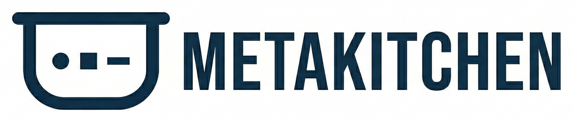

# MetaKitchen

MetaKitchen is a language-agnostic scaffold for AI-driven development across multiple repositories. It pre-wires every major AI coding agent to read a single `AGENTS.md`, so whichever agent a developer uses, it picks up the same shared instructions — no extra setup.

## Motivation

AI coding agents are multiplying fast — Claude Code, Cursor, Copilot, Codex, and more — but each has its own convention for discovering project instructions. On a collaborative open-source project, one contributor might use Claude Code while another uses Cursor and a third uses Copilot. Without a shared standard, each person's agent operates in isolation, unaware of the project's architecture, coding standards, or task plan.

MetaKitchen solves this by giving every agent a single entry point (`AGENTS.md`) through their native discovery mechanisms. Write your instructions once; every agent finds them automatically.

The name combines **meta-programming** with **kitchen orchestration** — a head chef (the orchestrator agent) directs multiple cooks (worker agents), each responsible for a different part of the meal, all following the same recipes.

## Who This Is For

MetaKitchen is for developers and teams who use AI coding agents as part of their daily workflow — especially those working across multiple repositories or with multiple agents. If you've ever wished your agent already knew your project's architecture, coding standards, and how the repos fit together, this is for you. No AI or prompt engineering experience required — just edit markdown files.

## What This Is Not

MetaKitchen is not an agent tailored for any specific language, framework, or domain. It does not know about your frontend, backend, database, or deployment pipeline. It is a **bootstrap** — a starting structure and set of conventions on which you build your own project-specific agent instructions. You fill in the architecture, coding standards, API contracts, and custom rules that make it yours.

## What You Get

- **Agent pointer files** for 9 AI coding agents (Claude Code, Cursor, GitHub Copilot, Codex CLI, Cline, Roo Code, Junie, Windsurf, Gemini CLI) — all pointing at one `AGENTS.md`.
- **Role routing** — every agent pointer file automatically selects orchestrator or worker role based on task scope. Per-repo `.claude/CLAUDE.md` files declare worker identity.
- **`metak-shared/`** — read-only shared context: project overview, architecture docs, API contracts, coding standards, glossary, and a LEARNED.md for discovered methods.
- **`metak-orchestrator/`** — a workspace for a coordinating agent with TASKS.md, STATUS.md, EPICS.md, and DECISIONS.md.
- **`<project>.code-workspace`** — a VS Code multi-root workspace (named after your project folder) so all repos appear in one sidebar.
- **`CUSTOM.md`** files for project-specific instructions that won't be overwritten by updates. The orchestrator writes these to configure workers.
- **`metak` CLI** — a lightweight utility to install, update, and manage agent instructions across your codebases (`metak install`, `metak add`, `metak uninstall`).
- **Updates to the instructions** — as contributors add improvements to the scaffold code, they can be pulled into existing projects without overwriting custom instructions.


## Quickstart

The instructions below have been tested in Windows 10/11. If you are on a different OS, you may need to adjust the environment variable setup step. 

Please contribute back any OS-specific instructions you find to the documentation!

### Prerequisites
- **Python 3.7+** — for the `metak` CLI (no extra packages needed)
- **Git** — each sub-repo is its own git repository
- **VS Code** (recommended) — for the multi-root workspace experience
- **Claude Code CLI** (optional) — only needed for `metak feedback` (`npm install -g @anthropic-ai/claude-code`)

### 1. Install MetaKitchen (one-time)

Clone this repo and run setup:

```bash
git clone https://github.com/tiagrib/metakitchen.git
cd metakitchen
pip install -e .
metak setup
```

This sets the `METAK_HOME` environment variable and adds `metak` to your PATH. You only need to do this once.

### 2. Initialize a project

In your project's root directory, run:

```bash
cd my-project
metak install
```

This copies the MetaKitchen template into your project — agent pointer files (with role routing), `AGENTS.md`, `CUSTOM.md`, `metak-shared/` (overview, architecture, api-contracts, coding standards, glossary, LEARNED.md), `metak-orchestrator/` (TASKS.md, STATUS.md, EPICS.md, DECISIONS.md), and the workspace file. Existing files are not overwritten (use `--force` to update them, except `CUSTOM.md` files which are always preserved).

### 3. Add sub-repos

Add your repos and register them in the workspace. MetaKitchen supports both submodule and monorepo layouts:

```bash
# Submodule layout (each repo is a separate git repository)
git submodule add https://github.com/your-org/frontend frontend
metak add frontend

# Monorepo layout (all code in one git repository)
mkdir backend
metak add backend

# Or a mix of both - for example, a monorepo for frontend, utilities and integration tests, and a separate repo (submodule) for backend
```

Either way, `metak add` registers each folder in the `.code-workspace` file, scaffolds a starter `AGENTS.md`, `CUSTOM.md`, and `.claude/CLAUDE.md` (with worker identity) inside it. See [Usage](metakitchen/usage.md) for details on both layouts.

### 4. Open the workspace

```bash
code my-project.code-workspace
```

Then edit `CUSTOM.md` at the root and fill in `metak-shared/` with any additional documentation and specification to describe your project. Any AI agent opened in any sub-repo will automatically pick up those instructions. Additional documentation and specs will also be added by the Orchestrator agent after you start providing it with goals and tasks.

## How Orchestration Works

Open one agent session in `metak-orchestrator/` and describe the goal. If you're using VSCode, just open the `metak-orchestrator/AGENTS.md` file and then launch a chat using that file as context. The orchestrator plans the work, write specs, a task breakdown to `TASKS.md`, configures workers via `CUSTOM.md` files, then spawns a worker agent per repo to implement each task. When workers finish, the orchestrator reviews their output against acceptance criteria and project goals, iterating with follow-up tasks until quality is met — all in the same session.

If your agent doesn't support subagent spawning, the orchestrator will tell you which tasks to run manually and in which repo folder.

## Commands

| Command | Description |
|---|---|
| `metak setup` | Set `METAK_HOME` and add to PATH (one-time) |
| `metak install [target]` | Copy MetaKitchen template into a project directory |
| `metak uninstall [target]` | Remove MetaKitchen files from a project directory |
| `metak add <folder>` | Register a sub-repo in the workspace and scaffold its `AGENTS.md`, `CUSTOM.md`, and `.claude/CLAUDE.md` |
| `metak feedback [target]` | Analyze project customizations and suggest improvements for the main templates (requires Claude Code CLI) |
| `metak update [target]` | Pull latest metak templates and suggest updates for the project (requires Claude Code CLI) |

## Documentation

See the [metakitchen/](metakitchen/) folder for detailed guides:

- [File Structure](metakitchen/file-structure.md) — layout and what each part is for
- [Usage](metakitchen/usage.md) — workflows and common operations
- [Configuration](metakitchen/configuration.md) — agent pointer files and customization
- [Tips](metakitchen/tips.md) — practical guidance for day-to-day use

## Prerequisites

- **Python 3.7+** — for the `metak` CLI (no extra packages needed)
- **Git** — each sub-repo is its own git repository
- **VS Code** (recommended) — for the multi-root workspace experience
- **Claude Code CLI** (optional) — required only for `metak feedback` (`npm install -g @anthropic-ai/claude-code`)

## License

[MIT](metakitchen/LICENSE)
